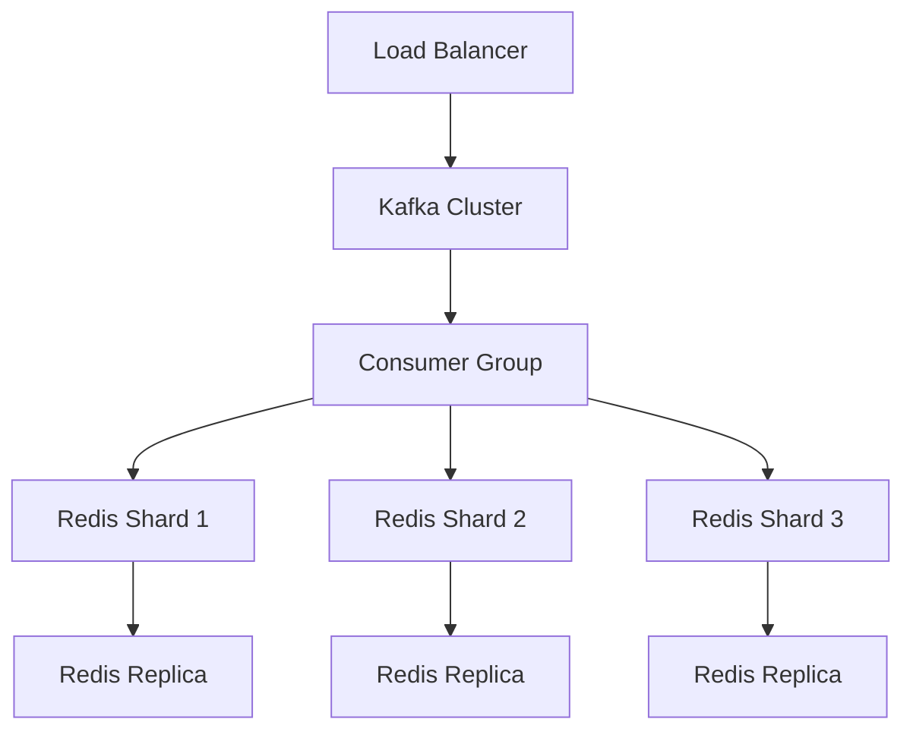

# E-Commerce Event Processing System with Redis Sharding

## Overview

A scalable real-time event processing system that handles e-commerce user behavior data (views, carts, purchases) with Redis sharding for distributed storage. The system simulates production traffic patterns from historical data and processes events through a Kafka pipeline.


## Key Features

- **Real-time Event Streaming**: Processes 285M+ e-commerce events from Kaggle dataset
- **Intelligent Sharding**: Consistent hashing for balanced Redis distribution
- **Fault Tolerance**: Automatic failover handling for shard outages
- **Scalable Design**: Horizontally scalable components (Kafka consumers, Redis shards)
- **Real-time Monitoring**: Built-in metrics and dashboard

## Getting Started

### Prerequisites

- Docker 20.10+
- Java 17
- Scala 2.12
- sbt 1.8

### Installation

1. Clone the repository:
   ```bash
   git clone https://github.com/yourrepo/ecommerce-sharding.git
   cd ecommerce-sharding
   ```

2. Start infrastructure:
   ```bash
   docker-compose up -d
   ```

3. Run the application:
   ```bash
   sbt run
   ```

## System Components

### 1. Data Pipeline

```
CSV Dataset → Kafka Producer → Kafka Cluster → Sharded Consumers → Redis Cluster
```

### 2. Sharding Strategy

```scala
class ConsistentHasher(virtualNodes: Int = 100) {
  // Uses MD5 hashing with virtual nodes
  // Guarantees minimal reshuffling when adding/removing shards
}
```

### 3. Monitoring Stack

- Prometheus metrics endpoint
- Grafana dashboard (port 3000)
- Redis Commander (port 8081)

## Dataset Integration

The system uses the [Kaggle E-Commerce Behavior Dataset](https://www.kaggle.com/mkechinov/ecommerce-behavior-data-from-multi-category-store) containing:

- 285 million events
- User sessions across product categories
- Event types: views, cart additions, purchases
- Timestamps for realistic replay

To use the real dataset:
1. Download from Kaggle
2. Place in `data/raw/`
3. Run preprocessing:
   ```bash
   sbt "runMain com.ecommerce.DataPreprocessor"
   ```

## Future Improvements Roadmap

### Enhanced Analytics
- [ ] Real-time recommendation engine
- [ ] User session analytics
- [ ] Fraud detection patterns

### Production Readiness
- [ ] Kubernetes deployment manifests
- [ ] Terraform scripts for AWS/GCP
- [ ] CI/CD pipeline

### Advanced Features
- [ ] Geo-distributed sharding
- [ ] Dynamic scaling controller
- [ ] Multi-datacenter replication

## Development Guide

### Branch Strategy

```
main         - Production releases
develop      - Integration branch
feature/*    - New features
hotfix/*     - Critical fixes
```

### Testing

Run the test suite:
```bash
sbt test
```

Test coverage:
```bash
sbt coverage test coverageReport
```

## Monitoring Endpoints

| Service       | URL                          | Port  |
|---------------|------------------------------|-------|
| Grafana       | http://localhost:3000        | 3000  |
| Prometheus    | http://localhost:9090        | 9090  |
| Redis Commander| http://localhost:8081       | 8081  |
| Kafka UI      | http://localhost:8080        | 8080  |

## Performance Benchmarks

| Metric               | Single Shard | 3 Shards |
|----------------------|-------------|----------|
| Events/sec           | 12,000      | 34,000   |
| 99th %ile Latency    | 45ms        | 22ms     |
| Recovery Time        | N/A         | 1.2s     |

## Production Deployment

### Recommended Infrastructure



### Configuration Guide

1. Adjust shard count in `application.conf`:
   ```hocon
   redis {
     shards = [
       {host = "redis1", port = 6379},
       {host = "redis2", port = 6379},
       {host = "redis3", port = 6379}
     ]
   }
   ```

2. Set Kafka properties:
   ```hocon
   kafka {
     bootstrap-servers = "kafka1:9092,kafka2:9092,kafka3:9092"
     topic = "user-events"
     partitions = 12
   }
   ```

## Troubleshooting

### Common Issues

1. **Shard Imbalance**:
   ```bash
   # Check distribution
   redis-cli -p 6379 dbsize
   redis-cli -p 6380 dbsize
   ```

2. **Kafka Lag**:
   ```bash
   docker exec kafka kafka-consumer-groups --bootstrap-server localhost:9092 \
     --describe --group sharded-consumer-group
   ```

3. **Memory Issues**:
   ```bash
   # Monitor Redis memory
   redis-cli info memory
   ```

## License

Apache 2.0 - See [LICENSE](LICENSE) for details.

## Contributing

1. Fork the repository
2. Create your feature branch
3. Submit a pull request

---

**Project Maintainer**:  
- Zwiswa Muridili  

**Last Updated**: 14 June 2025
